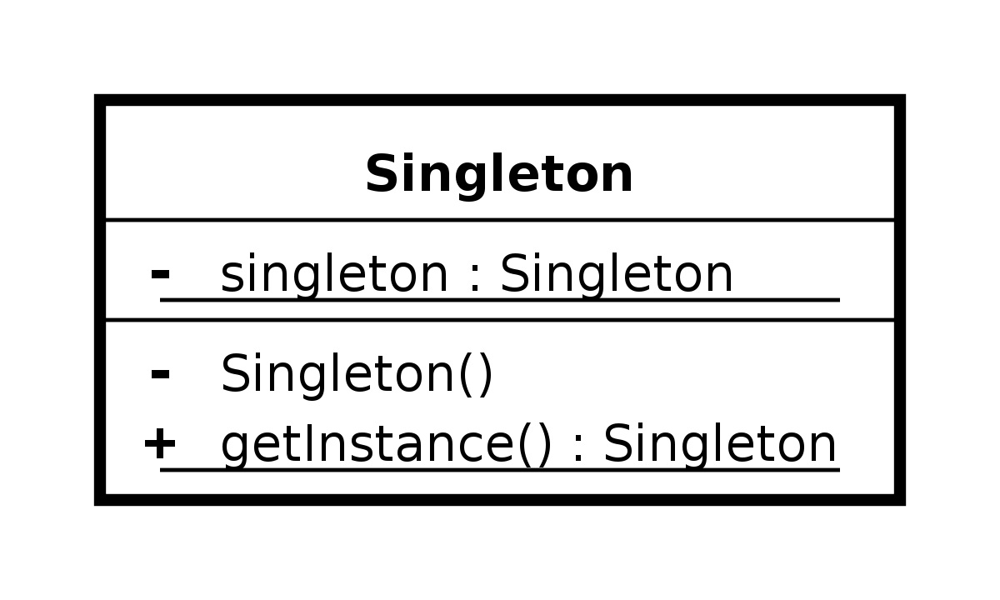

# Nombres:
 Hernan Arenas - 20161020078

Andres Ramirez - 20161020077

Kevin Rocha - 20161020086

# Object pool 
El patrón object pool es un patrón de diseño de software que usa un conjunto de objetos inicializados preparados para su uso. Esto es más efectivo normalmente que creando y destruyento los objetos bajo demanda. Un cliente del pool le pedirá un objeto para realizar las operaciones con el objeto. Cuando el cliente termina retorna el objeto al pool para que lo retenga hasta que vuelva a necesitar usarse. Es decir, los objetos no se crean (salvo la primera vez) ni se destruyen, simplemente se van reciclando.
# Singleton o instancia unica
es un patrón de diseño que permite restringir la creación de objetos pertenecientes a una clase o el valor de un tipo a un único objeto.
Su intención consiste en garantizar que una clase sólo tenga una instancia y proporcionar un punto de acceso global a ella.
El patrón singleton se implementa creando en nuestra clase un método que crea una instancia del objeto sólo si todavía no existe alguna. Para asegurar que la clase no puede ser instanciada nuevamente se regula el alcance del constructor (con modificadores de acceso como protegido o privado).

